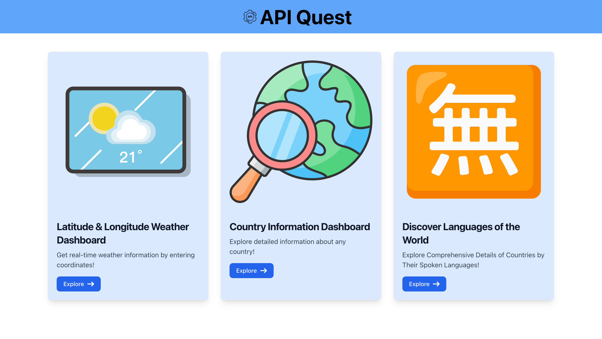
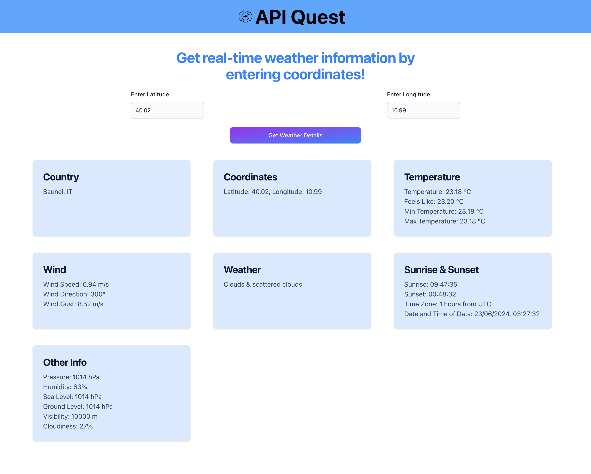
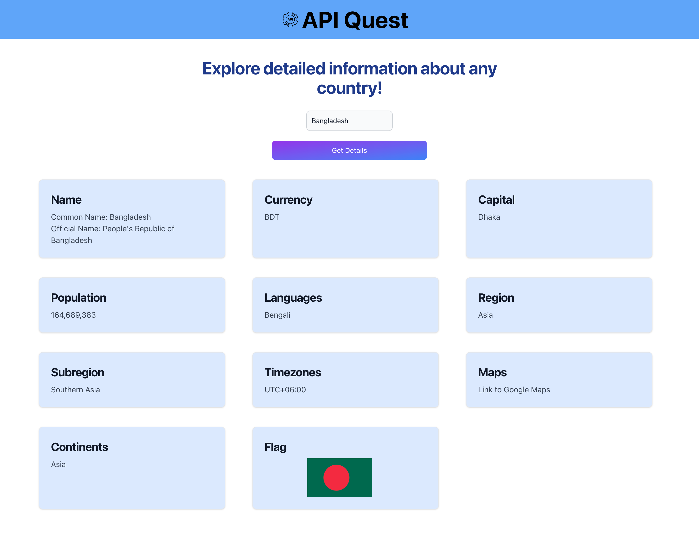
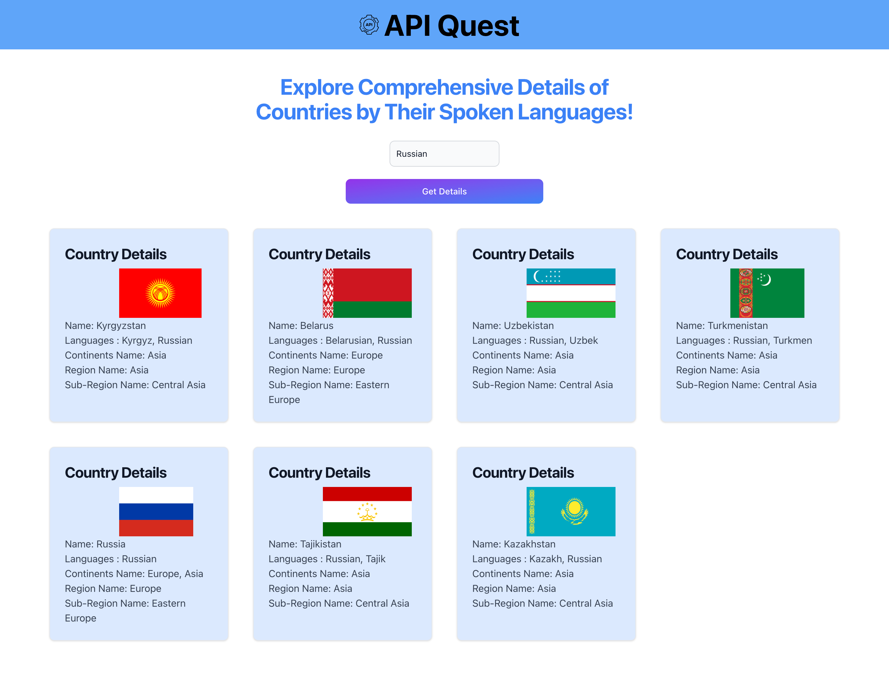

# API Quest

API Quest is a React web application that connects to an external API to retrieve and display data based on user queries. This project showcases how to integrate API calls within a React application to fetch and present information dynamically.

## Technologies Used

- **Frontend**: React, Axios
- **Styling**: Tailwind CSS
- **API**: [Rest Countries API v3.1](https://restcountries.com/) & [Open Weather Map](https://openweathermap.org/)

## Usage

- Navigate through the different dashboards:
  - Click on "Latitude & Longitude Weather Dashboard" to fetch weather information.
  - Click on "Country Information Dashboard" to explore details about countries.
  - Click on "Discover Languages of the World" to view linguistic details across countries.
 
## Preview

  

  
### Latitude & Longitude Weather Dashboard

- Get real-time weather information by entering geographic coordinates (latitude and longitude).
- Display details such as temperature, wind speed, weather conditions, sunrise and sunset times and other relevant weather information.

  
  

### Country Information Dashboard

- Explore detailed information about any country by entering the country name.
- Provides data such as the common and official names, currency, capital city, population, languages spoken, region, subregion, timezones and the country flag.

  
  

### Discover Languages of the World

- Explore comprehensive details of countries by their spoken languages.
- Provides insights into the linguistic distribution across the globe.

  
  
